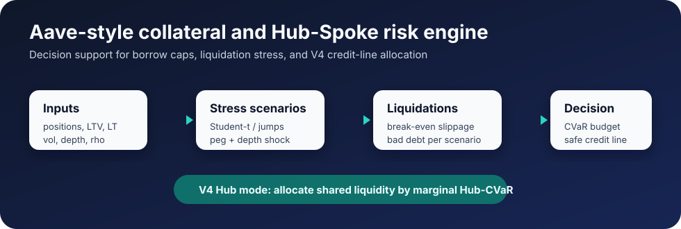

# Aave Risk Engine


Decision-support tooling for Aave-style collateral risk and V4 Hub-Spoke credit-line sizing.

> Independent research prototype. This project is not affiliated with, endorsed by, or sponsored by Aave Labs or the Aave DAO.



The project answers two related questions:

1. **Single Spoke:** how large can a borrow cap / credit line be before 99% CVaR bad debt breaches a risk budget?
2. **Hub allocation:** how should one shared Hub balance be split across multiple Spokes with different volatility, liquidity, and correlation?

This is not an automated risk agent and not a governance replacement. It is a compact quant prototype for making risk/growth trade-offs explicit.

## 60-Second Tour

- Sizes a borrow cap / V4 Spoke credit line from 99% CVaR bad debt.
- Models both V3 liquidation mechanics and V4's live design (repay to
  target health factor, dynamic bonus) and compares them on real books.
- Simulates multi-period stress paths with re-liquidation, waiting
  stalls, and depth replenishment, quantifying how conservative the
  single-shock convention is.
- Treats liquidation slippage as a liquidator cost while incentives work, and as a protocol recovery cost only when liquidations stall.
- Models fat-tailed and jump-diffusion stress, peg widening, and liquidity-depth evaporation.
- Allocates one shared Hub balance across Spokes by marginal Hub-CVaR.
- Shows why lower-correlation Spokes can receive credit even when they look risky standalone.

## Read Next

- [Case study: reproducing the July 2026 Linea cap reductions](docs/case_studies/2026-07-linea-cap-reductions.md)
- [Methodology](METHODOLOGY.md)
- [Implementation notes](IMPLEMENTATION.md)

## What It Models

```text
borrower book + stressed collateral scenarios
  -> health factors and liquidation queue
  -> liquidator participation threshold: slippage <= bonus / (1 + bonus)
     (queue-average, or sequential clearing in bonus-priority order)
  -> cleared liquidations: protocol loss is insolvency gap
  -> stalled liquidations: protocol marks collateral to delayed executable value
  -> bad-debt distribution
  -> VaR / CVaR / recommended cap
```

For V4-style Hub allocation, one standardized systemic factor drives all Spokes:

```text
u_k = rho_k * Z + sqrt(1 - rho_k^2) * e_k
```

The allocator greedily assigns credit to the Spoke with the lowest marginal Hub-CVaR per dollar until the Hub balance or CVaR budget binds. Marginal premia are approximately equalized because the allocator is discrete.

Aave V4 has been live on Ethereum mainnet since March 2026 with governed Spoke add/draw caps, cross-Hub credit lines, and a collateral risk premium (launched at 0 bps): the quantities this engine sizes. See the [V4 activation ARFC](https://governance.aave.com/t/arfc-aave-v4-activation-on-ethereum-mainnet/24293).

## Results Preview

The [results page](docs/results.md) covers the July 30 real-data analyses
and includes a guide to the synthetic demo figures below.

### Single-Spoke Credit-Line Sizing

The chart below is the core decision view. It sweeps the borrow cap / Spoke credit line and reports the resulting 99% CVaR bad debt. The recommended cap is the largest exposure that stays inside the chosen risk budget.


### Liquidation Capacity

Liquidators clear positions only while execution slippage is below break-even:

```text
slippage <= bonus / (1 + bonus)
```

Below that line, slippage is a liquidator cost compensated by the bonus. Above it, liquidations stall and the protocol marks collateral to delayed executable value.


### Loss Distribution

Most scenarios have no bad debt. The relevant risk is concentrated in the far right tail, which is why the engine uses CVaR rather than only VaR.


### Hub Allocation Example

The Hub demo allocates a `$700m` USDC Hub balance across three Spokes under an `$8m` CVaR budget.

| Spoke | rho | Credit line | Standalone CVaR | Risk premium / $1m |
|---|---:|---:|---:|---:|
| stETH | 0.95 | $70m | $2.0m | $48.5k |
| WBTC | 0.85 | $315m | $4.2m | $79.4k |
| LONGTAIL | 0.45 | $105m | $2.6m | $61.6k |

In this run, total credit is `$490m` (`70%` of Hub balance), Hub CVaR is `$7.9m`, and diversification benefit is about `$0.9m`. The exact numbers vary with Monte Carlo seed and allocation granularity; the qualitative story is the point.

## Install

```bash
python -m venv .venv
.\.venv\Scripts\Activate.ps1   # Windows PowerShell
pip install -e ".[dev]"
```

On macOS/Linux:

```bash
python -m venv .venv
source .venv/bin/activate
pip install -e ".[dev]"
```

## Run

```bash
python -m aave_risk_engine.run_demo
python -m aave_risk_engine.run_hub_demo
python -m aave_risk_engine.run_market_report
python -m aave_risk_engine.run_episode_replay
python -m aave_risk_engine.run_v4_comparison
python -m aave_risk_engine.run_multiperiod
python -m streamlit run aave_risk_engine/dashboard.py
```

Tests:

```bash
python -m aave_risk_engine.tests.test_engine
python -m aave_risk_engine.tests.test_hub
python -m aave_risk_engine.tests.test_data
python -m aave_risk_engine.tests.test_multiperiod
```

## Real Market Data (Aave V3)

The `data/` layer replaces synthetic assumptions with observed Aave V3
state (Ethereum mainnet and Linea), using only keyless public sources and
the standard library:

- **On-chain reserve state** (public JSON-RPC): liquidation threshold, LTV,
  liquidation bonus, supply/borrow caps, current supply and debt, oracle price.
- **Real borrower book**: borrowers discovered from recent `Borrow` events,
  account aggregates from `Pool.getUserAccountData`, filtered to accounts
  dominated by the target collateral. Each account keeps its own on-chain
  weighted-average liquidation threshold.
- **Depth calibration**: routed sell quotes (Paraswap on mainnet, KyberSwap
  on Linea) at a ladder of USD sizes. The engine interpolates the observed
  points directly, because real exit liquidity cliffs (wstETH: ~0.3%
  slippage at $2m, >50% at $9m) cannot be represented by a single-parameter
  curve.
- **Debt denomination**: WETH-denominated debt is measured per account.
  Leveraged-staking loopers (collateral and debt both ETH-correlated) are
  excluded from the default USD-shock book, and modeled explicitly in the
  combined book, where ETH-denominated debt scales with the scenario ETH
  return and looper risk comes from the LST/ETH exchange rate and depth,
  not the USD price level.
- **Stress calibration**: realized volatility and a Student-t tail fitted
  from Kraken price history; stETH/ETH peg history from Coingecko.
- **ARFC checks**: the [Aave Risk Framework](https://governance.aave.com/t/arfc-aave-risk-framework/25114)
  peg rule (no >=1% deviation sustained >=2 days) and its requirement that
  depth must clear the largest borrower within the liquidation bonus,
  evaluated as the engine's liquidator break-even condition.

- **Historical episode replay**: the realized ETH and stETH/ETH paths of
  past stress episodes (Terra/Celsius depeg May-June 2022, FTX November
  2022, the market window around the March 2023 USDC depeg) are rolled
  through today's books and today's depth curve, window by window. The
  June 2022 replay liquidates the current whale loopers through the
  exchange-rate channel; in the FTX replay the peg stayed tight through
  the loss-driving crash window, leaving loopers untouched. Episodes
  supply only the ETH and stETH/ETH paths; liability-side effects such
  as the USDC depeg itself are not modeled.

Snapshots and episode paths are committed JSON (`data/snapshots/`,
`data/episodes/`), so the reports, tests, and CI run offline and
deterministically. Refresh with:

```bash
python -m aave_risk_engine.data.build_snapshot --chain ethereum --asset wstETH
python -m aave_risk_engine.data.build_snapshot --chain linea --asset WETH
```

The market report then compares governance dials against model output:
current cap and usage, tail risk of the real book, the model-safe exposure
for a chosen CVaR budget, and the clearance test under quiet and stressed
depth.

## Dashboard

The Streamlit dashboard has two tabs:

- **Single Spoke:** reserve-style risk simulation, recommended max-safe cap, slippage/loss/cap/LT charts, and a worst-case scenario inspector.
- **Hub allocation (V4):** editable Spoke table, Hub balance and CVaR budget, systemic return law, severity, credit lines, risk premia, and diversification gain.

Demo tip: in the Hub tab, lower `LONGTAIL`'s `rho`. Its credit line should rise and the diversification gain should increase.

## Repository Layout

```text
aave_risk_engine/
  config.py              dataclass inputs
  stress.py              return laws and stressed scenarios
  positions.py           synthetic and real borrower books
  liquidation.py         liquidation and bad-debt accounting
  slippage.py            concentrated-liquidity execution shortfall
  engine.py              single-Spoke Monte Carlo engine
  multiperiod.py         multi-period simulation with book-state evolution
  hub.py                 multi-Spoke Hub allocator
  data/                  Aave V3 on-chain state, prices, depth, snapshots
    aave_v3.py           per-chain reserve/caps/account readers (raw eth_call)
    markets.py           price history, vol/tail calibration, ARFC peg rule
    depth.py             slippage-curve fit from aggregator quotes
    book.py              snapshot -> real PositionBook and calibrated config
    clearance.py         ARFC largest-borrower clearance test
    build_snapshot.py    live snapshot builder CLI
    episodes.py          historical stress episodes and rolling-window replay
    build_episodes.py    episode price-path fetcher CLI
    snapshots/           committed JSON snapshots (offline/deterministic)
    episodes/            committed episode price paths
  dashboard.py           Streamlit UI
  run_demo.py            single-Spoke demo
  run_hub_demo.py        Hub allocation demo
  run_market_report.py   real-market report: caps vs model-safe exposure
  run_episode_replay.py  historical stress paths through today's book
  run_v4_comparison.py   V3 vs V4 liquidation mechanics on the same book
  run_multiperiod.py     multi-period stress paths with re-liquidation
  tests/                 invariant/economics tests
```

## Honest Limitations

- Real books use an effective single-asset mapping: an account's whole
  collateral is shocked as the target asset (with the account's own average
  liquidation threshold). No borrower-level cross-collateral modeling yet.
- Borrower discovery scans recent `Borrow` events, so dormant borrowers
  outside the scan window are missed.
- Slippage uses one concentrated-liquidity curve fitted to aggregator quotes;
  no CEX depth or venue-concentration modeling.
- Hub allocation is a static snapshot with one systemic factor.
- The model is meant for analysis and discussion, not production parameter automation.

See [METHODOLOGY.md](METHODOLOGY.md) for more detail.
