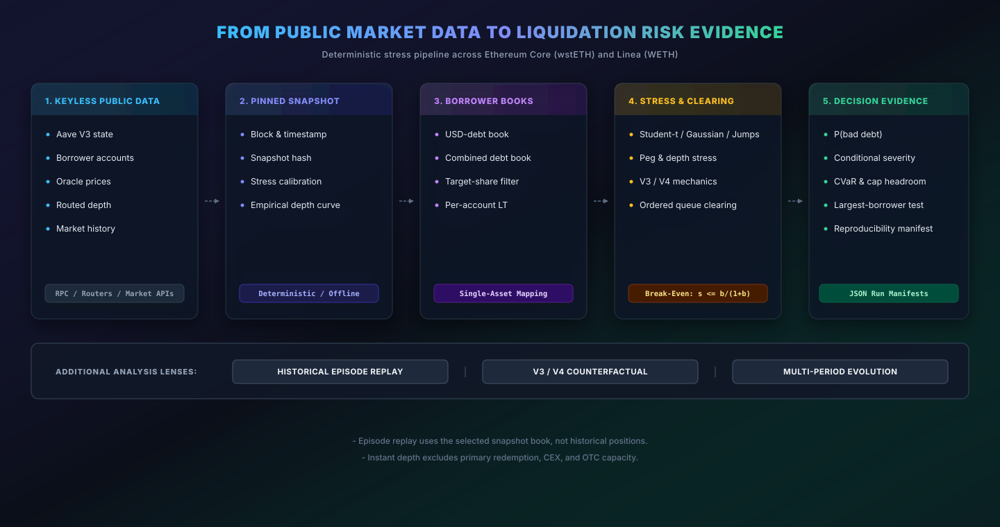
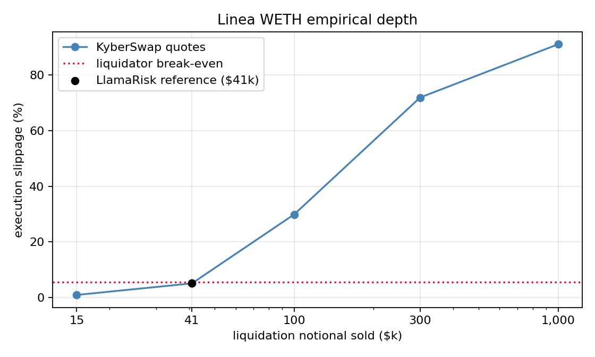

# Aave Risk Engine

```text
         ___    ___ _   ________     ____  _________ __ __
        /   |  /   | | / / ____/    / __ \/  _/ ___// //_/
       / /| | / /| | |/ / __/      / /_/ // / \__ \/ ,<
      / ___ |/ ___ | / / /___     / _, _// / ___/ / /| |
     /_/  |_/_/  |_|__/_____/    /_/ |_/___//____/_/ |_|

     --- LIQUIDATION CAPACITY STRESS ENGINE ---
```

[](https://github.com/BianchiGiacomo/aave-risk-engine/actions/workflows/tests.yml)


A quantitative research prototype for Aave collateral risk and liquidation
capacity. It combines pinned Aave V3 reserve state, real borrower accounts,
oracle prices, and routed depth quotes in reproducible reports, an interactive
dashboard, and machine-readable run manifests.

> Independent research prototype. This project is unaffiliated with Aave
> Labs, the Aave DAO, Chaos Labs, LlamaRisk, or any other Aave service
> provider. It is not a parameter recommendation, production risk system, or
> substitute for Risk Steward judgment.

The Aave market evidence is frozen at August 18, 2026. Every market result is
tied to a block and snapshot hash, so it is not a claim about the live market
on the day this page is read. The separate HYG RWA proxy was retrieved on
August 31, 2026 and is pinned as an offline CSV and manifest.



## Main Evidence

| Snapshot | Block | Date |
|---|---:|---:|
| Aave V3 Ethereum Core, wstETH reserve | 25,780,402 | 2026-08-18 |
| Aave V3 Linea, WETH reserve | 31,749,322 | 2026-08-18 |

| Analysis | Reproduced result |
|---|---|
| Ethereum USD-debt book | `$634.47m` debt; `P(loss) 0.55%`; `$8.70m` conditional severity; `CVaR99 $4.78m` |
| Ethereum combined book | `$964.28m` debt, including `$329.46m` ETH-denominated; `P(loss) 3.64%`; aggregate `CVaR99 $31.82m`; ordered `CVaR99 $15.25m` |
| Strict wstETH clearance | `$256.52m` largest sale versus `$2.73m` instantly clearable within the 6% bonus: `FAIL` |
| wstETH time-to-exit | DEX-only: `23.21d` quiet and `186.72d` stressed; the seven-day redemption requirement is `$29.54m/day` or `$40.93m/day` |
| Liquidator economics | Quiet DEX-only minimum bonus `6.29%`; stressed DEX-only `13.49%`; an illustrative optimized `$25m/day` redemption route lowers it to `4.66%` |
| Linea WETH reproduction | `$43.20k` independently clearable versus LlamaRisk's approximately `$41k`; `$300.47k` largest sale: `FAIL` |
| Historical replay | June 2022 worst combined-book window: `$42.20m`; stressed FTX window: `$381.42k`; modeled USDC window: zero |
| Four-day matched paths | Combined-book V3: `$32.78m` terminal-only CVaR99 versus `$31.85m` evolving-book CVaR99 |
| RWA backstop test | If `3-5%` is economic compensation, it supports only `2.59-4.45%` NAV loss; HYG context `10.87%`; stress-shape bracket `19.78%` |

The market report uses aggregate clearing by default. The dashboard uses the
more realistic ordered queue. The two-day market report and four-day
multi-period run are different horizon conventions and should not be compared
as one experiment. Sparse-loss results include frequency, conditional
severity, and positive-loss counts because CVaR99 may contain many zeros.



The Linea figure compares the observed quote ladder, the liquidator
break-even line, LlamaRisk's reference, and the largest borrower sale.

## What It Models

- USD-debt and combined borrower books, including ETH-denominated looper debt.
- Gaussian, Student-t, and jump-diffusion returns with peg stress and depth
  haircuts.
- Empirical slippage, ordered queue clearing, and V3 or V4 liquidation sizing.
- Historical episode replay on the current book and evolving multi-period
  liquidation paths.
- Strict instant clearance, time-to-exit, DEX refill, and optional primary
  redemption.
- Liquidator funding, hedging, recovery loss, capital hurdle, and optimized
  DEX/redemption route allocation.
- RWA four-session drawdowns, conditional stress clustering, economic-loss
  ceilings, and permissioned-liquidator bonus sensitivity.
- Loss frequency, expected loss, conditional severity, VaR, CVaR, Wilson
  intervals, cap sweeps, and JSON manifests.

V4 parameters are applied to the same V3 borrower book as a controlled
mechanics counterfactual. They are not live V4 positions. Synthetic
single-Spoke sizing and Hub allocation remain available as secondary demos.

## Quick Start

```bash
git clone https://github.com/BianchiGiacomo/aave-risk-engine
cd aave-risk-engine
python -m venv .venv
```

Windows PowerShell:

```powershell
.\.venv\Scripts\Activate.ps1
python -m pip install -e ".[dev]"
python -m streamlit run dashboard.py
```

macOS or Linux:

```bash
source .venv/bin/activate
python -m pip install -e ".[dev]"
python -m streamlit run dashboard.py
```

## Dashboard

The Streamlit dashboard is a real-market workbench for Ethereum wstETH and
Linea WETH. It loads committed snapshots offline and only accesses public
sources when the user explicitly requests a refresh.

| Tab | Purpose |
|---|---|
| Overview | Exposure, tail decomposition, cap sweep, loss distribution, and borrower concentration |
| Sensitivities | Scenario inputs, loss drivers, depth stress, and fixed-book LT transition sensitivity |
| Clearance | Strict ARFC test, exit horizon, redemption, route allocation, and liquidator economics |
| V3 / V4 | Matched liquidation mechanics on the selected V3 book |
| Episodes | Historical ETH and peg paths replayed on the wstETH book |
| Multi-period | Terminal shocks versus evolving paths with depth and peg controls |
| Data | Snapshot block, calibration sources, registry coverage, refresh, and download |

Expensive analyses run only after their tab button is pressed. Failed live
refreshes leave the committed snapshot active, and the dashboard never
overwrites committed files.

## Reproduce The Reports

Run these commands from the cloned repository root after installation:

```bash
python -m aave_risk_engine.run_market_report --snapshot data/snapshots/aave_v3_ethereum_wsteth.json --manifest docs/manifests/ethereum-wsteth-2026-08-18.json
python -m aave_risk_engine.run_market_report --snapshot data/snapshots/aave_v3_linea_weth.json --budget 500000 --figure --manifest docs/manifests/linea-weth-2026-08-18.json
python -m aave_risk_engine.run_episode_replay
python -m aave_risk_engine.run_v4_comparison
python -m aave_risk_engine.run_multiperiod
python -m aave_risk_engine.run_time_to_exit --redemption-usd-per-day 25000000
python -m aave_risk_engine.run_liquidator_balance_sheet --redemption-usd-per-day 25000000
python -m aave_risk_engine.run_rwa_drawdown_stress --manifest docs/manifests/hinc-hyg-proxy-2026-08-31.json
python -m aave_risk_engine.run_oracle_reachability --fixture data/oracle/ethereum-wsteth-25946216.json --manifest docs/manifests/ethereum-wsteth-oracle-reachability-25946216.json
python -m aave_risk_engine.run_simultaneous_requirement --manifest docs/manifests/ethereum-wsteth-simultaneous-requirement-2026-08-18.json
python -m aave_risk_engine.run_four_test_assessment --manifest docs/manifests/ethereum-wsteth-four-test-assessment-25780402.json
```

The oracle fixtures under `data/oracle/` are built over the network by
`data.build_oracle_fixture`. The last three commands run offline against
committed fixtures and manifests.

The assessment reprices warehouse economics at its p99 requirement.
Optional `--financing <evidence.json>` supplies documented capital;
see the [assessment template](docs/assessment-template.md) for its schema
and the distinction between identified capital and a capacity upper bound.

Add `--ordered` to `run_market_report` to match the dashboard queue convention.
See [consolidated results](docs/results.md) for the exact output and parameters.

## Refresh Market Data

From the dashboard sidebar, open **Snapshot data**:

1. Select **Refresh from public sources** to build a live session snapshot.
2. Use **Download active snapshot** to save the exact JSON under analysis.
3. Use **Restore committed snapshot** to return to the frozen release evidence.

For a saved CLI workflow, build a new file under `.runtime/` and pass it to any
report with `--snapshot`:

```bash
python -m aave_risk_engine.data.build_snapshot --chain ethereum --asset wstETH --registry-out .runtime/aave_v3_ethereum.json --account-cache-dir .runtime --out .runtime/ethereum-wsteth-live.json
python -m aave_risk_engine.data.build_snapshot --chain linea --asset WETH --registry-out .runtime/aave_v3_linea.json --account-cache-dir .runtime --out .runtime/linea-weth-live.json
python -m aave_risk_engine.run_market_report --snapshot .runtime/ethereum-wsteth-live.json --ordered
```

The builder copies and extends the committed borrower registry, while its
SQLite account cache lets interrupted RPC reads resume. Refreshes use public
JSON-RPC, Kraken, DefiLlama with a Coingecko fallback, and ParaSwap or
KyberSwap quotes. Public endpoints may rate-limit or reject requests; committed
snapshots keep the project reproducible offline.

## Method And Documentation

The real-book mapping selects target-dominant accounts and represents their
total collateral as the target asset while retaining their weighted on-chain
liquidation threshold. Ordered clearing consumes depth tranche by tranche.
Slippage is a liquidator cost while execution remains profitable and becomes
a protocol recovery cost only after liquidation stalls.

Economic clearance complements the strict instant test. It asks whether the
liquidation bonus covers financing, hedge, recovery, execution, and required
return over a stated exit horizon. Redemption throughput and DEX refill are
explicit sensitivities, not measured guarantees.

Read next:

- [Consolidated results](docs/results.md)
- [Mathematical model specification](docs/model-specification.md)
- [Methodology](METHODOLOGY.md)
- [Implementation notes](IMPLEMENTATION.md)
- [Linea cap-reduction case study](docs/case_studies/2026-07-linea-cap-reductions.md)
- [wstETH oracle reachability case study](docs/case_studies/2026-09-aave-wsteth-oracle-reachability.md)
- [Four-test assessment format](docs/assessment-template.md) and its [worked wstETH assessment](docs/assessments/2026-08-18-aave-v3-ethereum-wsteth.md)
- [Published governance research note](https://governance.aave.com/t/independent-liquidation-capacity-stress-tests-for-aave/25503)
- [Governance article source](docs/article/governance-post-draft.md)
- [Run manifest documentation](docs/manifests/README.md)

The strict clearance test follows the
[Aave Risk Framework](https://governance.aave.com/t/arfc-aave-risk-framework/25114).
The V4 counterfactual uses the governed
[Ethereum activation parameters](https://governance.aave.com/t/arfc-aave-v4-activation-on-ethereum-mainnet/24293).

## Limitations

- Borrower discovery replays Pool `Borrow` events and re-queries every known
  borrower at one pinned block. It assumes debt originated through that event
  history.
- The effective single-asset mapping does not model every collateral and debt
  asset separately.
- DEX refill, CEX or OTC liquidity, and Lido stress redemption capacity are
  not empirically measured by the current release.
- The warehouse model assumes full upfront repayment, sufficient financing,
  an ETH/USD hedge, deterministic capacity, and a static route allocation.
- Empirical slippage is flat beyond the final quote and is only a lower bound
  there.
- Rare-loss CVaR and conditional severity remain low-sample estimates until
  targeted rare-event sampling is implemented.
- Episode replay applies historical paths to the selected current book; it is
  not an archive reconstruction of historical positions or liquidity.
- The committed HYG series is a market-price benchmark, not HINC NAV or the
  exact 70/30 high-yield and CLO blend. Its stress-shape bracket is heuristic.
- Hub allocation is synthetic and is not connected to live V4 Spokes.

## Verification

```bash
python -m aave_risk_engine.tests.test_engine
python -m aave_risk_engine.tests.test_hub
python -m aave_risk_engine.tests.test_data
python -m aave_risk_engine.tests.test_multiperiod
python -m aave_risk_engine.tests.test_time_to_exit
python -m aave_risk_engine.tests.test_liquidator_balance_sheet
python -m aave_risk_engine.tests.test_rwa_drawdown
python -m aave_risk_engine.tests.test_oracle_reachability
python -m aave_risk_engine.tests.test_simultaneous_requirement
python -m aave_risk_engine.tests.test_four_test_assessment
```

The project contains 190 offline tests: 23 engine, 5 Hub, 50 data, 10
multi-period, 8 time-to-exit, 19 liquidator balance-sheet, and 6 RWA drawdown
tests, plus 29 oracle, 8 simultaneity and 32 assessment tests. GitHub
Actions runs all ten suites on Python 3.11 and 3.12.

## License

MIT. See [LICENSE](LICENSE).
