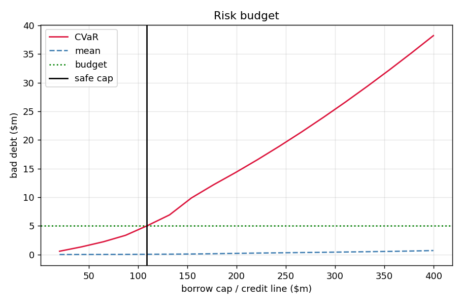
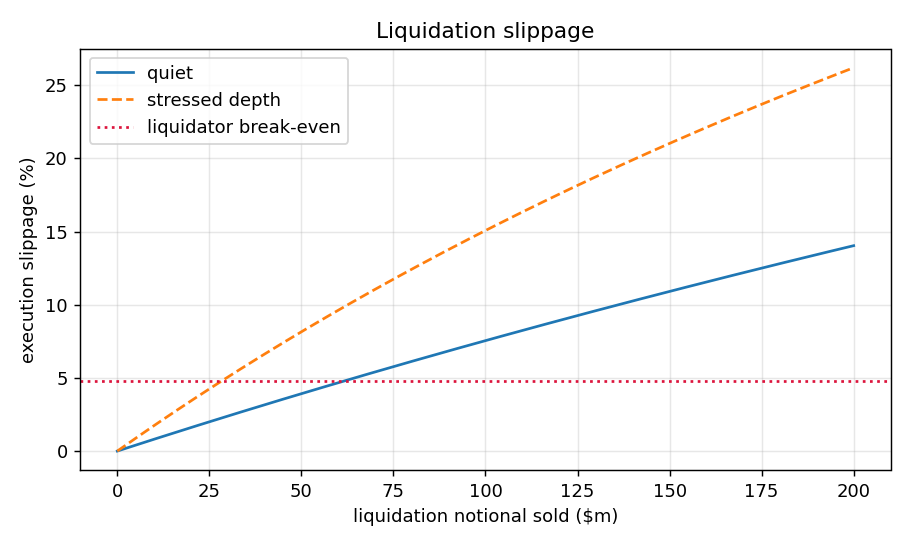
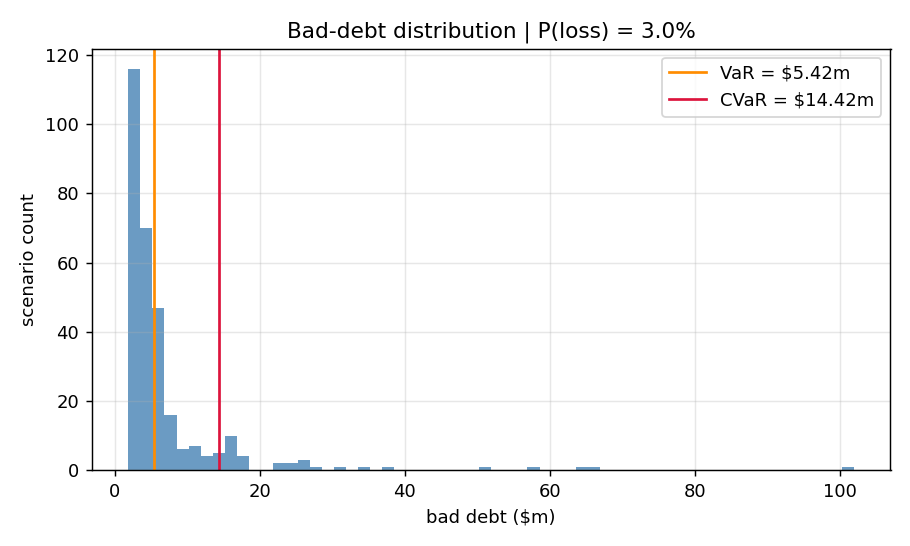

# Results

This page is the consolidated results narrative for the real-data analyses.
It separates current market conclusions from demonstrations that depended on
an earlier exposure regime.

## Data Vintage

The current committed snapshots were built on July 30, 2026:

| Market | Block |
|---|---:|
| Ethereum mainnet wstETH | 25,645,558 |
| Linea WETH | 31,568,531 |

Borrower discovery uses recent Borrow events, so dormant accounts outside the
scan window may be absent. The reports use committed snapshots and run
offline.

## 1. Mainnet wstETH Market Report

Command:

```bash
python -m aave_risk_engine.run_market_report
```

Trimmed output from the July 30 mainnet snapshot at block 25,645,558:

```text
USD-debt book entering the engine: 36 accounts | debt $142.35m | collateral $374.77m | median HF 1.85

Tail risk at observed book exposure
  P(bad debt) : 0.03%
  VaR99       : $0
  CVaR99      : $360.66k

Combined book with ETH-denominated debt modeled
  full book: 40 accounts | debt $449.92m (of which ETH-denominated $307.37m)
  P(bad debt) 0.11% | VaR99 $0 | CVaR99 $20.95m

Model-safe debt exposure (CVaR99 budget $5.00m)
  observed book debt : $142.35m
  model safe exposure: $427.05m
  headroom           : +$284.70m (+200%)

ARFC clearance test (largest borrower within liquidation bonus)
  largest borrower sale          : $307.60m
  largest borrower account       : 0x893aa69fbaa1ee81b536f0fbe3a3453e86290080
  target collateral / debt       : $320.36m / $290.19m
  ETH-denominated debt share     : 100.00%
  caution: the sale exceeds the quote ladder top ($25.00m)
  quiet depth    : slippage >= 75.74% | max clearable $2.60m -> FAIL
```

The USD debt book is benign under this calibration. Its current exposure has
200% model exposure headroom before the 5 million dollar CVaR budget binds.
The combined book tells a different story. Rare peg and depth stress reaches
large ETH debt loopers, producing a 20.95 million dollar CVaR despite only a
0.11% bad debt probability.

The strict ARFC clearance test fails because the largest borrower sale is
about 308 million dollars against 2.6 million dollars of instant clearable
depth. This is an instant routed on-chain test. A wstETH liquidator can also
use the redemption queue over days, which the strict test does not credit.
The 75.74% figure is the last observed Paraswap ladder point and only a lower
bound for the 307.60 million dollar sale, not an extrapolated whale quote.
Large Paraswap ladder points are indicative best routes and not guaranteed
execution.
The main conclusion is therefore about concentration versus immediate exit
capacity, not total eventual recovery capacity.

## 2. Linea WETH Reproduction

The full writeup is the
[July 2026 Linea cap reduction case study](case_studies/2026-07-linea-cap-reductions.md).

Command:

```bash
python -m aave_risk_engine.run_market_report --snapshot aave_risk_engine\data\snapshots\aave_v3_linea_weth.json --budget 500000 --figure
```

Trimmed output from the July 30 Linea snapshot at block 31,568,531:

```text
Aave V3 WETH market report (linea) | block 31,568,531 (2026-07-30)

ARFC clearance test (largest borrower within liquidation bonus)
  liquidator break-even slippage : 5.66%
  largest borrower sale          : $46.44k
  quiet depth    : slippage 8.61% | max clearable $41.77k -> FAIL
  stressed depth (50% haircut) : slippage 27.85% | max clearable $20.88k -> FAIL
```

The independent clearance estimate moved from 32.5 thousand dollars on July
18 to 41.8 thousand dollars on July 30. It now almost exactly matches
LlamaRisk's approximately 41 thousand dollar estimate, while the formal
clearance verdict remains FAIL because the largest borrower sale is about
46.4 thousand dollars.

## 3. Historical Episode Replay

Command:

```bash
python -m aave_risk_engine.run_episode_replay
```

This replay uses the July 30 mainnet book at block 25,645,558. It applies
historical price and peg paths to today's positions and depth. It does not
reconstruct historical borrower books.

```text
Historical episode replay | wstETH (ethereum) block 25,645,558 | horizon 2d

Episode: ftx-2022 (2022-11-01 to 2022-11-30)
  combined book :  quiet depth: max bad debt        $0  stressed depth: max bad debt        $0

Episode: steth-depeg-2022 (2022-05-01 to 2022-06-29)
  combined book :  quiet depth: max bad debt  $227.62m (2022-06-16)  stressed depth: max bad debt  $227.62m (2022-06-16)
  driving windows (combined, quiet): 2022-06-16 (eth +1.8%, peg 4.93%) $227.62m

Episode: usdc-depeg-2023 (2023-02-28 to 2023-03-20)
  combined book :  quiet depth: max bad debt        $0  stressed depth: max bad debt        $0
```

The June 2022 peg window activates the whale channel and produces 227.62
million dollars of bad debt on the current combined book. The FTX and USDC
windows are clean for the modeled collateral channels. The timing matters:
the worst realized peg moves need not coincide with the worst ETH return
windows. A contemporaneous crash beta can therefore overstate or misplace
peg stress, which motivates a lagged coupling model.

## 4. V3 And V4 Liquidation Mechanics

Command:

```bash
python -m aave_risk_engine.run_v4_comparison
```

The result is regime dependent. The July 16 snapshot at block 25,546,280
provided a useful mid-size liquidation regime. It showed the mechanics
tradeoff directly:

```text
USD-debt book ($146.42m)
  V3 (on-chain params)  aggregate: P(bad debt)  4.56% | mean  $42.38k | VaR99  $892.29k | CVaR99    $1.66m
  V3 (on-chain params)  ordered  : P(bad debt)  4.56% | mean  $38.57k | VaR99  $892.29k | CVaR99    $1.28m
  V4 Main Spoke         aggregate: P(bad debt)  9.52% | mean  $38.44k | VaR99  $746.25k | CVaR99    $1.62m
  V4 Main Spoke         ordered  : P(bad debt)  9.52% | mean  $35.40k | VaR99  $746.25k | CVaR99    $1.32m
```

V4 Main increased the frequency of some loss because repay-to-target sold
more collateral near the threshold, but it reduced severity beyond the loss
threshold. Ordered clearing reduced CVaR by roughly 20% to 25% in this
regime because early tranches could clear before later positions exhausted
depth.

The July 16 snapshot is recoverable as
`data/snapshots/aave_v3_ethereum_wsteth.json` at commit `ac9f2ae`. Pass that
JSON to the current CLI through `--snapshot` to reproduce the older block.

The July 30 snapshot at block 25,645,558 is a different regime:

```text
combined book ($449.92m)
  V3 (on-chain params)  aggregate: P(bad debt)  0.11% | mean $209.48k | VaR99        $0 | CVaR99   $20.95m
  V3 (on-chain params)  ordered  : P(bad debt)  0.11% | mean $205.36k | VaR99        $0 | CVaR99   $20.54m
  V4 Main Spoke         aggregate: P(bad debt)  0.11% | mean $209.48k | VaR99        $0 | CVaR99   $20.95m
  V4 Main Spoke         ordered  : P(bad debt)  0.11% | mean $208.34k | VaR99        $0 | CVaR99   $20.83m
  V4 correlated Spoke   aggregate: P(bad debt)  0.11% | mean $209.48k | VaR99        $0 | CVaR99   $20.95m
  V4 correlated Spoke   ordered  : P(bad debt)  0.11% | mean $206.39k | VaR99        $0 | CVaR99   $20.64m
```

One whale is now far larger than instant depth, so V3 versus V4 and
aggregate versus ordered clearing largely wash out. The apparent
contradiction is the result: liquidation mechanics matter in the middle,
while concentration dominates after exposure crosses the available exit
capacity by two orders of magnitude.

## 5. Multi-Period Simulation

Command:

```bash
python -m aave_risk_engine.run_multiperiod
```

The July 30 mainnet snapshot at block 25,645,558 shows the size of the
single-shock conservatism over a four-day window:

```text
combined book ($449.92m)
  V3                single: P(bad debt)  0.69% | mean   $1.24m | CVaR99  $124.05m
  V3                multi : P(bad debt)  0.30% | mean $539.01k | CVaR99   $53.90m
```

The single-shock convention is about 2.3 times the evolving path result in
this run, consistent with the broader finding that it is roughly two to
three times conservative. Intermediate clears deleverage accounts, stalled
positions can recover, and depth can replenish between periods.

The July 16 mid-size regime at block 25,546,280 exposed the target health
factor mechanism that the current whale regime masks:

```text
V4 Main (1.24)    multi : P(bad debt) 12.29% | mean  $58.15k | CVaR99    $1.31m | marks 100% of losses | events/path 0.24 | P(reliq) 0.02%
V4 corr (1.0137)  multi : P(bad debt)  0.39% | mean   $3.49k | CVaR99  $348.74k | marks 100% of losses | events/path 0.57 | P(reliq) 11.24%
```

Restoring health factor to 1.24 almost eliminated repeat liquidation.
Restoring only to 1.0137 left positions close enough to the boundary that
11.24% of paths liquidated a position again. This is why target health
factor should be evaluated with an evolving book rather than only a
terminal shock.

## Interpretation

Across the five analyses, market structure is the first-order result.
Current USD debt exposure can look safe while a correlated whale remains
unclearable through immediate market depth. Liquidation design changes the
distribution materially when queues are comparable with depth, but no
mechanics choice can compensate for a single account that is more than one
hundred times the instant clearance capacity.

## Synthetic Demo Figure Guide

The synthetic single Spoke figures are generated by:

```bash
python -m aave_risk_engine.run_demo
```

### Credit-Line Decision



The red curve shows 99% CVaR bad debt as the borrow cap or Spoke credit line
increases. The green horizontal line is the risk budget. The vertical marker
is the largest modeled exposure that stays inside that budget. The curve
bends upward because larger liquidation queues create worse execution
shortfall and more stalled-liquidation risk.

### Liquidation Capacity



The slippage curve maps liquidation notional to execution shortfall. The
horizontal line is liquidator break-even, `bonus / (1 + bonus)`. Below it,
the liquidator can absorb execution cost. Above it, liquidation incentives
fail and the protocol is marked to delayed executable recovery.

### Bad-Debt Tail



Most scenarios create no bad debt. CVaR measures the average loss in the
worst 1% of scenarios, so it captures severity beyond the VaR threshold.

### Hub-Spoke Allocation

The Hub example is generated by:

```bash
python -m aave_risk_engine.run_hub_demo
```

The allocator adds credit to the Spoke with the lowest marginal Hub CVaR per
dollar until the Hub balance or risk budget binds. Lower-correlation Spokes
can receive credit even when they are risky alone because they diversify the
Hub tail.
