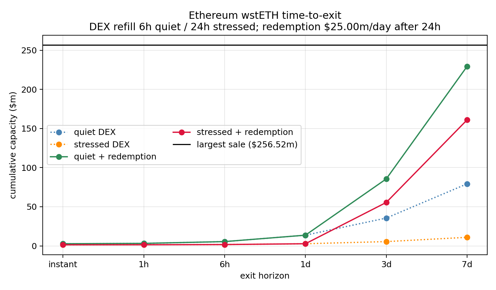
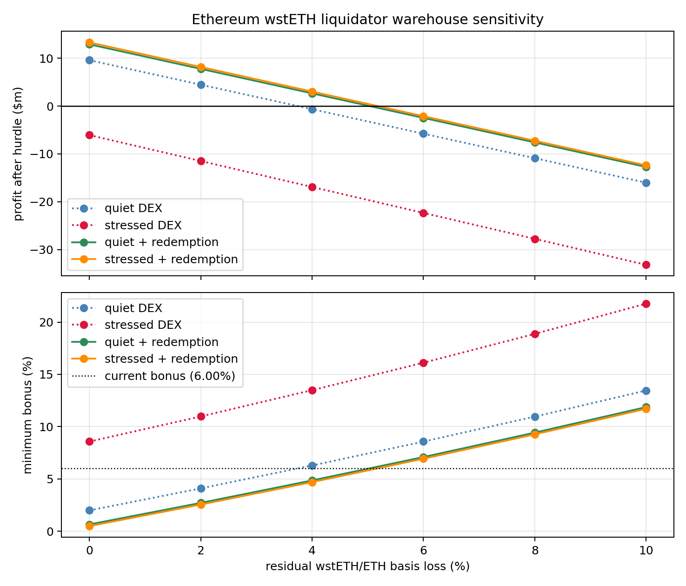

# Results

This page is the consolidated narrative for the real-data analyses. All
primary results use the complete borrower registries and block-pinned August
18, 2026 snapshots committed with the release.

## Data Vintage

| Market | Block | Borrow registry | Active debt accounts stored |
|---|---:|---:|---:|
| Ethereum mainnet wstETH | 25,780,402 | 84,427 candidates | 9,526 |
| Linea WETH | 31,749,322 | 13,397 candidates | 51 |

The registry covers every `Borrow` event from the configured Aave V3 Pool
proxy deployment through the snapshot block. Every historical candidate is
then re-queried at that one block; the snapshot stores all accounts with at
least $10,000 of current debt. The target-share and debt-denomination filters
are applied later when a report constructs a book.

The earlier July and August 17 snapshots used rolling event discovery plus a
prior-snapshot seed. They remain useful historical artifacts, but their
borrower-book totals are not comparable with this release. Direct reserve
state and quote ladders do not depend on borrower discovery.

## 1. Mainnet wstETH Market Report

Command:

```bash
python -m aave_risk_engine.run_market_report --snapshot data/snapshots/aave_v3_ethereum_wsteth.json --manifest docs/manifests/ethereum-wsteth-2026-08-18.json
```

Trimmed output from block 25,780,402:

```text
borrower registry: blocks 16,291,127 to 25,780,402 | 84,427 candidates | 9,526 with debt >= $10.00k

USD-debt book entering the engine: 790 accounts | debt $634.47m | collateral $1.67bn | median HF 1.94

Tail risk at observed book exposure
  positive draws: 110 / 20,000
  P(bad debt)  : 0.550% (95% Wilson CI 0.457% to 0.662%)
  expected loss: $47.85k
  loss severity: $8.70m conditional on positive loss
  VaR99        : $0
  CVaR99       : $4.78m (worst 200 draws)

Combined book with ETH-denominated debt modeled
  full book: 855 accounts | debt $964.28m (of which ETH-denominated $329.46m)
  P(bad debt) 3.64% | VaR99 $5.49m | CVaR99 $31.82m

Model-safe debt exposure (CVaR99 budget $5.00m)
  observed book debt : $634.47m
  model safe exposure: $657.66m
  headroom           : +$23.19m (+4%)

ARFC clearance test (largest borrower within liquidation bonus)
  largest borrower sale          : $256.52m
  largest borrower account       : 0x893aa69fbaa1ee81b536f0fbe3a3453e86290080
  target collateral / debt       : $273.24m / $242.00m
  ETH-denominated debt share     : 100.00%
  caution: the sale exceeds the quote ladder top ($25.00m)
  quiet depth    : slippage >= 74.10% | max clearable $2.73m -> FAIL
```

The corrected USD-debt book is close to, but still within, the exploratory
$5 million CVaR budget. The 110 positive draws support the frequency estimate
better than prior vintages, while conditional severity remains a model output
that should be stress-tested with targeted tail sampling.

The combined book exposes the LST looper channel. Its tail is materially
larger because modeled relative-value and depth stress can reach
ETH-denominated debt positions. Under the live mainnet oracle, the former is a
counterfactual canonical-rate impairment, not an ordinary secondary-market
depeg trigger. The deterministic clearance test is stricter still: the largest
sale is about 94 times the instant clearable amount. The 74.10% slippage is the
final Paraswap point and only a lower bound beyond $25 million. The test
excludes CEX, OTC, and redemption capacity, so FAIL concerns immediate routed
liquidity rather than eventual recovery.

## 2. Linea WETH Reproduction

The full writeup is the
[July 2026 Linea cap reduction case study](case_studies/2026-07-linea-cap-reductions.md).

Command:

```bash
python -m aave_risk_engine.run_market_report --snapshot data/snapshots/aave_v3_linea_weth.json --budget 500000 --figure --manifest docs/manifests/linea-weth-2026-08-18.json
```

Trimmed output from block 31,749,322:

```text
borrower registry: blocks 12,430,836 to 31,749,322 | 13,397 candidates | 51 with debt >= $10.00k

USD-debt book entering the engine: 22 accounts | debt $887.88k | collateral $4.41m | median HF 1.55

Tail risk at observed book exposure
  positive draws: 6 / 20,000
  P(bad debt)  : 0.030% (95% Wilson CI 0.014% to 0.065%)
  expected loss: $25
  loss severity: $82.02k conditional on positive loss
  VaR99        : $0
  CVaR99       : $2.46k (worst 200 draws)
  WARNING: fewer than 30 positive-loss draws; CVaR and conditional severity are low-sample estimates

ARFC clearance test (largest borrower within liquidation bonus)
  liquidator break-even slippage : 5.66%
  largest borrower sale          : $300.47k
  quiet depth    : slippage 72.28% | max clearable $43.20k -> FAIL
  stressed depth (50% haircut) : slippage 83.32% | max clearable $21.60k -> FAIL
```

The independent maximum-clearance estimate progressed from $32.5 thousand on
July 18 to $41.8 thousand on July 30, $42.4 thousand on August 17, and $43.2
thousand on August 18. It remains close to LlamaRisk's approximately $41
thousand estimate. Complete discovery also finds a much larger current
borrower than the rolling scan did, strengthening the same deterministic
FAIL verdict.

This run illustrates sparse-loss reporting. Six losses have conditional
severity of $82.02 thousand, while CVaR99 is $2.46 thousand because 194 zeros
also enter the worst 1% average. CVaR is a valid unconditional budget measure
here, but it is not event severity and is weakly estimated from six events.

## 3. Historical Episode Replay

Command:

```bash
python -m aave_risk_engine.run_episode_replay
```

This is scenario replay on the August 18 book, not reconstruction of the
borrower books and liquidity that existed during each episode.

```text
Historical episode replay | wstETH (ethereum) block 25,780,402 | horizon 2d
books USD $634.47m | combined $964.28m (ETH $329.46m)

Episode: ftx-2022
  USD-debt book : quiet depth $236 | stressed depth $381.42k
  combined book : quiet depth $236 | stressed depth $381.42k

Episode: steth-depeg-2022
  USD-debt book : quiet depth $374 | stressed depth $439.76k
  combined book : quiet depth $42.20m | stressed depth $42.20m
  driving window: 2022-06-16 (ETH +1.8%, peg 4.93%) $42.20m

Episode: usdc-depeg-2023
  USD-debt and combined books: $0
```

The June 2022 market-discount window activates the modeled ETH-looper channel
even though its two-day ETH return is positive. Under today's exchange-rate
oracle, the $42.20 million result is a counterfactual canonical-rate impairment
of the same magnitude, not a replay of the actual 2022 liquidation trigger.
The timing result still shows that relative-value stress can lead or lag the
largest ETH move, while a contemporaneous crash-beta model forces the channels
together. The FTX stressed-depth loss is small and the USDC episode is outside
the modeled collateral channels.

## 4. V3 And V4 Liquidation Mechanics

Command:

```bash
python -m aave_risk_engine.run_v4_comparison
```

The CLI applies alternative mechanics to the same V3 positions and common
random scenarios. It is a counterfactual, not observed V4 borrower data.

```text
USD-debt book ($634.47m)
  V3                  aggregate: P 0.55% | mean $47.85k | CVaR99 $4.78m
  V3                  ordered  : P 0.55% | mean $28.41k | CVaR99 $2.84m
  V4 Main             aggregate: P 0.64% | mean $49.43k | CVaR99 $4.94m
  V4 Main             ordered  : P 0.64% | mean $36.17k | CVaR99 $3.62m
  V4 Correlated       aggregate: P 0.64% | mean $44.13k | CVaR99 $4.41m
  V4 Correlated       ordered  : P 0.64% | mean $22.57k | CVaR99 $2.26m

combined book ($964.28m)
  V3                  aggregate: P 3.64% | mean $361.46k | CVaR99 $31.82m
  V3                  ordered  : P 3.64% | mean $189.29k | CVaR99 $15.25m
  V4 Main             aggregate: P 3.64% | mean $404.53k | CVaR99 $32.85m
  V4 Main             ordered  : P 3.64% | mean $342.37k | CVaR99 $26.87m
  V4 Correlated       aggregate: P 3.64% | mean $403.24k | CVaR99 $32.83m
  V4 Correlated       ordered  : P 3.64% | mean $291.98k | CVaR99 $22.41m
```

Ordered clearing is material in the complete book. It reduces combined-book
CVaR by 52% for V3, 18% for V4 Main, and 32% for V4 Correlated because early
tranches clear before later transactions consume the remaining depth. V4
Main and Correlated refer to the governed parameter sets, including their
target health factors, bonus anchors, close-factor floors, and dust rules.
The differences are joint mechanics effects, not estimates from live V4
positions.

## 5. Multi-Period Simulation

Command:

```bash
python -m aave_risk_engine.run_multiperiod
```

The default comparison uses eight half-day periods over four days, 100% depth
replenishment between periods, and a calibrated 7.22-day peg-residual
half-life. Each single-shock and evolving row shares the same terminal return,
peg drop, and depth haircut path by path.

```text
combined book ($964.28m)
  V3             single: P  8.91% | mean $591.02k | CVaR99 $32.78m
  V3             multi : P 12.72% | mean $578.30k | CVaR99 $31.85m | P(reliq) 4.64%
  V4 Main        single:                         CVaR99 $51.08m
  V4 Main        multi :                         CVaR99 $47.84m | P(reliq) 0.21%
  V4 Correlated  single:                         CVaR99 $40.76m
  V4 Correlated  multi :                         CVaR99 $39.68m | P(reliq) 16.84%
```

The previous two-to-three-times gap disappears once the terminal shocks are
matched correctly. Evolving liquidation now reduces combined-book CVaR by
about 3% for V3, 6% for V4 Main, and 3% for V4 Correlated, although it can
raise the probability of some loss while reducing severity. The
re-liquidation contrast remains informative: restoring positions toward HF
1.24 creates more buffer than restoring toward 1.0137, but
the rows also differ in bonus and floor parameters, so the comparison is not
a pure target-HF experiment.

## 6. Mainnet wstETH Time-To-Exit

Command:

```bash
python -m aave_risk_engine.run_time_to_exit --snapshot data/snapshots/aave_v3_ethereum_wsteth.json --redemption-usd-per-day 25000000 --figure docs/assets/wsteth_time_to_exit.png --manifest docs/manifests/ethereum-wsteth-time-to-exit-2026-08-18.json
```

The deterministic sensitivity starts from the same `$256.52m` sale and
`$2.73m` instant capacity. Quiet DEX depth receives one equivalent refill every
six hours. The stressed regime applies a 50% depth haircut and a 24-hour
refill. The `$25m/day` redemption line starts after 24 hours and is explicitly
illustrative, not a live Lido queue estimate.

```text
Estimated time to clear
  quiet DEX              : 23.21d
  stressed DEX           : 186.72d
  quiet + redemption     : 7.76d
  stressed + redemption  : 10.63d

Required primary-redemption throughput to clear by horizon
 horizon |      quiet DEX |   stressed DEX
--------------------------------------------
      3d |   $110.49m/day |   $125.53m/day
      7d |    $29.54m/day |    $40.93m/day
```



The benchmark misses a seven-day pass in both regimes. Under the selected 10%
post-trigger collateral drawdown, the unresolved seven-day tranche marks to
`$1.18m` of conditional loss in quiet conditions and `$4.15m` under stress.
Those values are not forecasts of whole-account bad debt. The stronger output
is the required-throughput curve: governance can compare it with a separately
validated redemption-capacity estimate without changing the liquidation model.

## 7. Mainnet wstETH Liquidator Balance Sheet

Command:

```bash
python -m aave_risk_engine.run_liquidator_balance_sheet --snapshot data/snapshots/aave_v3_ethereum_wsteth.json --redemption-usd-per-day 25000000 --figure docs/assets/wsteth_liquidator_balance_sheet.png --manifest docs/manifests/ethereum-wsteth-liquidator-balance-sheet-2026-08-18.json
```

This deterministic extension keeps the strict instant `FAIL` and tests a
different question: can a liquidator repay `$242.00m` at time zero, warehouse
the `$256.52m` of seized collateral, hedge ETH/USD, and earn its required
return while exiting over time? The publication sensitivity assumes 10%
annual funding, a 10% annual capital hurdle, 0.10% hedge entry, 2% annual hedge
carry, and a 1% DEX execution-loss ceiling. These are assumptions, not observed
liquidator terms. The default strategy chooses one total DEX/redemption split
that maximizes economic profit and then executes each assigned route at its
earliest modeled capacity. This is a static allocation against deterministic
capacity, not an adaptive execution policy. V3 close factors may split
repayment across transactions.
Funding and hurdle both use the same capital-days base, so the stated 10% plus
10% rates represent a 20% annual economic capital charge.

The model separates two risks that should not be conflated. A canonical or
oracle-to-recovery loss affects collateral exited through either route. A
secondary-market DEX discount affects only the DEX-routed amount. The
publication sweep below sets the DEX discount to zero and varies canonical
loss. A DEX market discount should be incremental to the execution loss
already charged by the model, not a second encoding of the same quote impact.

Trimmed CLI output, with rows unchanged:

```text
Profit after hurdle by canonical recovery loss (DEX market discount fixed at 0.0%)
 canon. |    quiet DEX |   stress DEX | quiet + red. | stress + red.
--------------------------------------------------------------------
  0.0% |       $9.58m |      -$6.07m |      $13.40m |       $13.40m
  2.0% |       $4.47m |     -$11.49m |       $8.25m |        $8.25m
  4.0% |    -$655.26k |     -$16.92m |       $3.11m |        $3.11m
  6.0% |      -$5.78m |     -$22.34m |      -$2.04m |       -$2.04m
  8.0% |     -$10.90m |     -$27.77m |      -$7.18m |       -$7.18m
 10.0% |     -$16.02m |     -$33.19m |     -$12.33m |      -$12.33m

Current-bonus canonical-loss threshold (DEX market discount fixed at 0.0%)
  quiet DEX              : 3.74%
  stressed DEX           : not profitable at zero loss
  quiet + redemption     : 5.21%
  stressed + redemption  : 5.21%

Current-bonus DEX-discount threshold at zero canonical loss
  quiet DEX              : 3.74%
  stressed DEX           : not profitable at zero loss
  quiet + redemption     : >=99.50% (search ceiling)
  stressed + redemption  : >=99.50% (search ceiling)
```

The blended DEX-discount thresholds hit the search ceiling because the
optimizer can assign zero collateral to DEX at the assumed redemption rate.
This is route avoidance, not evidence that DEX execution can absorb a 99.5%
discount.

At 4% canonical loss and zero DEX market discount, the quiet DEX-only path
takes 30.11 days and requires a 6.29% minimum bonus. The stressed DEX-only path
takes 241.88 days and requires 13.49%. With the illustrative `$25m/day`
redemption channel, the optimizer assigns the full `$256.52m` to redemption.
Both matched-throughput regimes then take 11.26 days, produce `$3.11m` of
economic profit, and require a 4.66% minimum bonus.

```text
Economic-clearance decision at 4.0% canonical loss and 0.0% DEX market discount
  quiet DEX              : FAIL | current 6.00% | minimum 6.29% | gap +29 bps
  stressed DEX           : FAIL | current 6.00% | minimum 13.49% | gap +749 bps
  quiet + redemption     : PASS | current 6.00% | minimum 4.66% | gap -134 bps
  stressed + redemption  : PASS | current 6.00% | minimum 4.66% | gap -134 bps
```



The channel split is economically material when redemption is available. A
separate 4% DEX-only discount run is:

```bash
python -m aave_risk_engine.run_liquidator_balance_sheet --snapshot data/snapshots/aave_v3_ethereum_wsteth.json --redemption-usd-per-day 25000000 --canonical-losses 0 --dex-market-discount 0.04
```

With DEX-only exit, a 4% market discount has the same effect as a 4% canonical
loss because every tranche uses the DEX. With the illustrative redemption
route, primary recovery avoids that discount:

```text
Warehouse balance sheet at 0.0% canonical loss and 4.0% DEX market discount
  quiet DEX              : clear 30.11d | average exit 14.95d | DEX $256.52m | red. $0 | peak $242.26m | economic profit -$655.26k | ROI -0.27% | min bonus 6.29%
  stressed DEX           : clear 241.88d | average exit 120.46d | DEX $256.52m | red. $0 | peak $242.26m | economic profit -$16.92m | ROI -6.98% | min bonus 13.49%
  quiet + redemption     : clear 11.26d | average exit 6.15d | DEX $0 | red. $256.52m | peak $242.34m | economic profit $13.40m | ROI 5.53% | min bonus 0.46%
  stressed + redemption  : clear 11.26d | average exit 6.15d | DEX $0 | red. $256.52m | peak $242.34m | economic profit $13.40m | ROI 5.53% | min bonus 0.46%
```

The original capacity-first benchmark remains reproducible:

```bash
python -m aave_risk_engine.run_liquidator_balance_sheet --snapshot data/snapshots/aave_v3_ethereum_wsteth.json --redemption-usd-per-day 25000000 --canonical-losses 0.04 --route-strategy capacity_first
```

```text
Warehouse balance sheet at 4.0% canonical loss and 0.0% DEX market discount
  quiet + redemption     : clear 8.35d | average exit 4.52d | DEX $72.69m | red. $183.83m | peak $242.26m | economic profit $2.65m | ROI 1.09% | min bonus 4.86%
  stressed + redemption  : clear 10.76d | average exit 5.86d | DEX $12.42m | red. $244.09m | peak $242.26m | economic profit $3.03m | ROI 1.25% | min bonus 4.69%
```

This explains the old counterintuitive ordering. Capacity-first forced the
quiet path to sell more through the costlier DEX, while the depth haircut sent
more stressed collateral to zero-loss redemption. The optimizer removes that
artifact by selecting full redemption in both matched-throughput regimes. It
does not establish that `$25m/day` of throughput or `$242m` of financing is
available.

The canonical run holds redemption at `$25m/day` in both regimes as a
matched-throughput comparison. Because the optimizer selects full redemption,
the blended rows then do not load on DEX depth stress. This is not an
independence assumption. An explicit correlated stress run is:

```bash
python -m aave_risk_engine.run_liquidator_balance_sheet --snapshot data/snapshots/aave_v3_ethereum_wsteth.json --redemption-usd-per-day 25000000 --stressed-redemption-usd-per-day 12500000 --canonical-losses 0.04
```

Halving stressed redemption throughput makes the optimizer assign `$5.49m`
to DEX and `$251.03m` to redemption. Stressed blended profit falls from
`$3.11m` to `$2.37m`, exit time rises from 11.26 to 21.08 days, and the minimum
bonus rises from 4.66% to 4.98%. This is still an illustrative stress, not a
calibrated Lido queue response.

## 8. RWA Drawdown And Permissioned-Liquidator Stress

Command:

```bash
python -m aave_risk_engine.run_rwa_drawdown_stress --manifest docs/manifests/hinc-hyg-proxy-2026-08-31.json
```

This analysis responds to the backstop-sizing question raised in the
[HINC Horizon discussion](https://governance.aave.com/t/arfc-onboard-hinc-neuberger-securitize-high-income-tokenized-fund-to-aave-horizon/25500/2).
It does not estimate HINC. The exact 70/30 ICE BofA US High Yield Constrained
and J.P. Morgan CLOIE Post-BB daily blend is not published in the proposal.
The committed dataset instead pins 2,522 Yahoo Finance HYG adjusted-close
observations from July 1, 2016 through July 15, 2026, retrieved August 31,
2026. HYG is a market-price proxy, not HINC NAV or the CLOIE component.

A four-session return is close-to-close over five observations. Funding and
hurdle use the actual calendar days between the first and fifth observations.
The conditional statistic requires the start observation to be below its
inclusive rolling maximum by at least the selected drawdown threshold.

Trimmed CLI output, with rows unchanged:

```text
Worst empirical windows
  unconditional              : 2020-03-13 to 2020-03-19 | -10.87% | 6 calendar days
  after 5% drawdown           : 2020-03-13 to 2020-03-19 | prior -9.05% | forward -10.87% | lookbacks 20-250 stable
  after 10% drawdown          : 2020-03-17 to 2020-03-23 | prior -13.25% | forward -10.12% | lookbacks 20-250 stable

Worst calendar months
  1                          : 2020-03 | -10.03%
  2                          : 2022-06 | -7.05%

Worst-month-scaled bracket (heuristic, not a HINC estimate)
  ratio                      : 18.25% / 10.03% = 1.82x
  scaled four-session loss   : 19.78%

Minimum economic bonus
 scenario                         | NAV loss | cal. days | min bonus
-------------------------------------------------------------------
 3% loss sensitivity              |    3.00% |         4 |     3.32%
 5% loss sensitivity              |    5.00% |         4 |     5.49%
 HYG worst four-session window    |   10.87% |         6 |    12.56%
 worst-month-scaled bracket       |   19.78% |         6 |    25.07%
```

The conditional result is invariant for every rolling-maximum lookback from
20 through 250 sessions. The worst unconditional window already begins after
a 9.05% drawdown, so conditioning on 5% selects the same event. Conditioning
on 10% selects a slightly less severe forward loss, 10.12% rather than
10.87%. The clustering intuition is therefore substantively correct, but the
conditional statistic does not add a worse tail event beyond the
unconditional maximum in this proxy.

March 2020 is HYG's worst calendar month in the complete pinned sample. The
[HINC proposal](https://governance.aave.com/t/arfc-onboard-hinc-neuberger-securitize-high-income-tokenized-fund-to-aave-horizon/25500)
reports an 18.25% worst month for its exact blend. Their ratio is 1.82. Applying
that ratio to the HYG four-session loss gives a 19.78% bracket and a 25.07%
minimum bonus under the six-calendar-day observed window. This is a scaled
stress bracket, not a statistical estimate: it assumes that the monthly
relative-volatility ratio transfers to a four-session tail.

The bonus calculation assumes 10% annual funding, a separate 10% annual
capital hurdle, lump redemption at the end of the window, no hedge, and no
redemption fee. Charging four calendar days instead of the six elapsed days
would give 12.44% for the HYG window; the intervening weekend adds about 12
basis points.

Permissioning makes the decomposition important. Aave fixes the bonus ex ante
in either design, but a permissionless market allows another profitable
liquidator to enter. A whitelist removes that fallback, so the configured
bonus and committed financing must be adequate before stress begins. Gross
stablecoin financing is separate again: repaying `$100m` of debt requires
approximately `$100m` at time zero, regardless of whether the modeled recovery
loss is 3% or 5%. A common daily NAV update can also move many positions
through their threshold together. The relevant comparison is therefore 3% to
5% against a specified simultaneous repayment notional, not borrowed TVL in
isolation.

An exact HINC result still requires the dated blend series, proposed LTV and
liquidation threshold, bonus and close factor, position-level health factors,
the definition of the 3% to 5% commitment, and redemption cut-off,
throughput, fee, gating, and suspension assumptions.

## Interpretation

The corrected borrower universe changes the quantitative narrative. The USD
book is near the chosen budget rather than comfortably below it, the combined
tail is larger, and ordered execution materially changes CVaR. The two most
robust governance observations are deterministic: the independent Linea depth
estimate continues to reproduce LlamaRisk's figure, and the Ethereum largest
borrower remains far beyond instant routed depth. The time-to-exit extension
turns that second observation into explicit refill and redemption-throughput
requirements rather than a claim that eventual recovery is impossible. The
warehouse extension then shows which combination of capital duration,
canonical impairment, DEX market discount, exit route, and liquidation bonus
would make that delayed exit economic.

## Synthetic Demo Figure Guide

The synthetic single-Spoke figures are generated by:

```bash
python -m aave_risk_engine.run_demo
```

### Credit-Line Decision


The red curve shows 99% CVaR bad debt as the borrow cap or Spoke credit line
increases. The green horizontal line is the risk budget. The vertical marker
is the largest modeled exposure that stays inside that budget. The curve
bends upward because larger liquidation queues create worse execution
shortfall and more stalled-liquidation risk.

### Liquidation Capacity


The slippage curve maps liquidation notional to execution shortfall. The
horizontal line is liquidator break-even, `bonus / (1 + bonus)`. Below it,
the liquidator can absorb execution cost. Above it, liquidation incentives
fail and the protocol is marked to delayed executable recovery.

### Bad-Debt Tail


Most scenarios create no bad debt. CVaR measures the average loss in the
worst 1% of scenarios, so it captures severity beyond the VaR threshold.

### Hub-Spoke Allocation

The Hub example is generated by:

```bash
python -m aave_risk_engine.run_hub_demo
```

The allocator adds credit to the Spoke with the lowest marginal Hub CVaR per
dollar until the Hub balance or risk budget binds. Lower-correlation Spokes
can receive credit even when they are risky alone because they diversify the
Hub tail.
